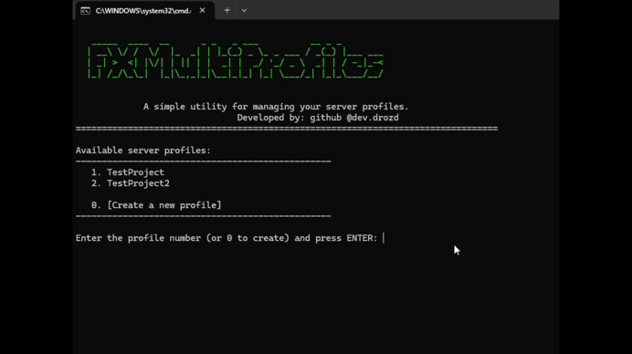

# FXServer Multi Profiles (Batch Script) [Windows Only]

**A simple and convenient utility for launching and creating FXServer profiles on Windows.**

This script works like an enhanced FXServer launcher:
- Quickly and easily launches the selected server profile.
- Allows you to create new profiles with name validation.
- Supports specifying a custom port for the server or using the default port.

With this script, you can easily:
- Launch the selected server profile.
- Create new profiles without unnecessary steps.
- Manage all profiles from a single convenient menu.

---

## ⚙️ Installation

1. Navigate to the folder for your preferred language and select the appropriate `FXMultiProfiles.bat` file.
2. Copy the `FXMultiProfiles.bat` file to your FXServer folder.
3. Ensure that the artifact folder containing `FXServer.exe` is in the same directory as the script. Example folder structure:
   ```
   yourserver/
   ├── artifact/
   │   └── FXServer.exe
   └── FXMultiProfiles.bat
   ```
4. Optionally, you can modify the `TXHOST_DATA_PATH` variable in the script to store profiles (txData) in a custom location:

   ```bat
   set TXHOST_DATA_PATH=D:/your/path/to/txData
   ```
6. You can also add custom settings before or after the `set TXHOST_DATA_PATH` line. For example available settings like `set TXHOST_*`, refer to [txAdmin Environment Configuration](https://github.com/citizenfx/txAdmin/blob/master/docs/env-config.md).

---

## 🚀 Usage

1. Double-click the `FXMultiProfiles.bat` file.
2. The menu will display available profiles or prompt you to create a new one.
3. Select an existing profile or create a new one — the script validates the name (only Latin letters and digits, no spaces).
4. Optionally, specify a custom port for the server or use the default port.
5. The script will launch `FXServer.exe` with the selected profile and port.

---

## 🖼 Preview



---

## 📄 License

MIT License — free to use, modify, and distribute.

---

## 💸☕️ Support the Project

If you find this script useful, consider supporting its development:

- [Donate via PayPal](https://www.paypal.com/donate/?hosted_button_id=UQGNYDVPER2TJ)
- [Donate via Revolut](https://revolut.me/devdrozd)
